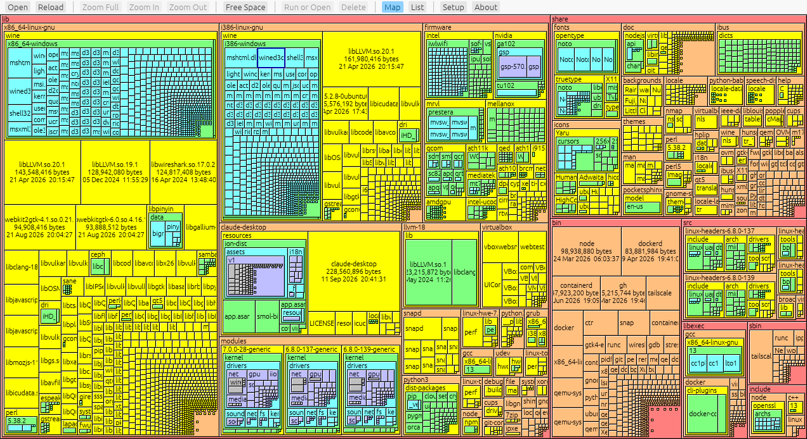
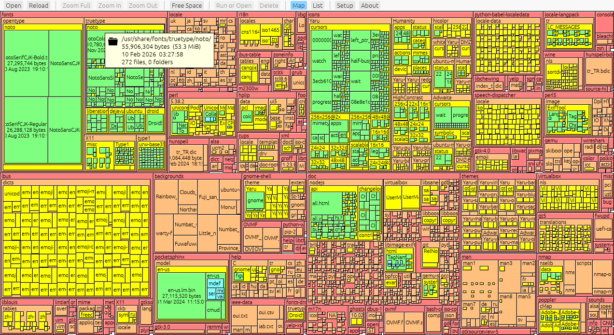
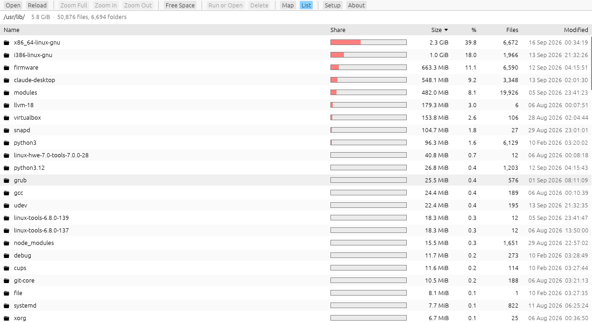

# Disk Haritası — Disk Map for Linux

A fast treemap disk usage viewer for Linux. Every folder is drawn as a box nested inside its
parent; the area of a box is proportional to the disk space it takes, and its color shows how
deep it is. Big files and forgotten folders stand out at a glance.

[Türkçe](README.tr.md)



| Classic layout (SpaceMonger 1.4 style) | List view |
|---|---|
|  |  |

## Features

- Scan a mount point or any folder, with live progress and cancel
- Stays on one file system by default (`/proc` and network mounts are skipped), counts hard
  links once, and measures the space actually used on disk
- Free space block when a whole volume is scanned
- Two layouts: squarified, or the classic SpaceMonger 1.4 split
- **List view:** folder contents with size bars, percentage, file count and modification date;
  click a column header to sort
- Click to select, double-click to enter a folder or open a file; Zoom Full / In / Out with
  animated transitions
- Info tips with size, date and file/folder counts
- Right-click menu: open, show in file manager, copy path, move to trash
- Delete protection: system folders (`/usr`, `/etc`, …), your home folder itself and mount
  points cannot be deleted
- Settings: density, horizontal/vertical bias, tip contents and delay; English and Turkish UI
  (picked from the system language)

## Install

Download the package for your CPU (`x86_64` or `aarch64`) from the
[Releases](../../releases) page:

```bash
tar xzf diskharitasi-*-linux-x86_64.tar.gz
cd diskharitasi-*-linux-x86_64
./install.sh      # installs to ~/.local/bin and adds a menu entry, no sudo needed
```

Or just run `./diskharitasi [FOLDER]` from the extracted folder.

**Requirements:** glibc 2.31 or newer (Ubuntu 20.04, Debian 11, Fedora 32, Linux Mint 20 and
later) and a Wayland or X11 desktop with OpenGL.

## Build from source

```bash
cargo build --release
./target/release/diskharitasi [FOLDER]
```

Needs Rust 1.85 or newer. No extra system libraries are required at build time.

## Acknowledgements

The look and behavior are inspired by **SpaceMonger 1.4** by Sean Werkema, whose
[source code is available under the MIT license](https://github.com/seanofw/spacemonger1).
The classic layout algorithm is adapted from that code (see the notice in `src/layout.rs`).
This project is an independent rewrite and is not affiliated with SpaceMonger.

## License

MIT, see [LICENSE](LICENSE).
