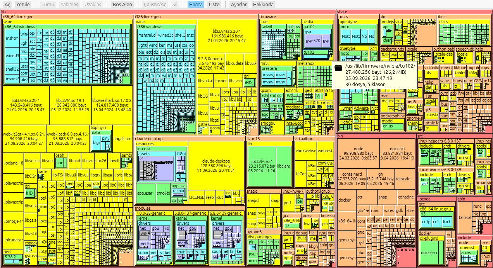
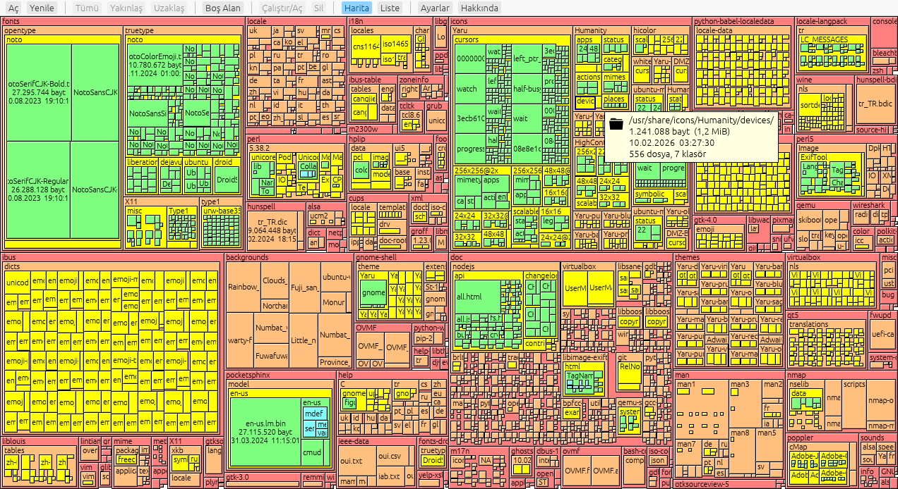
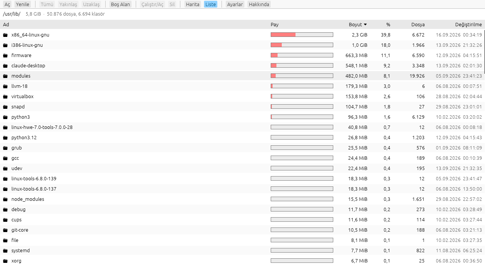

# Disk Haritası

Linux için treemap disk kullanım görüntüleyici. Klasörler iç içe kutular olarak çizilir;
kutunun alanı diskte kapladığı yerle orantılıdır, rengi kökten derinliğini gösterir.

*A treemap disk usage viewer for Linux. English UI is available in Settings.*



| Klasik yerleşim (SpaceMonger 1.4 tarzı) | Liste görünümü |
|---|---|
|  |  |

## Özellikler

- Bağlama noktası ya da herhangi bir klasörü tarama (ilerleme, iptal)
- Başka dosya sistemlerine geçmeme (`/proc`, ağ bağları taranmaz), sert bağları bir kez sayma,
  boyut olarak diskte kaplanan alan
- Disk kökü taranınca boş alan bölmesi
- İki yerleşim: kareye yakın (squarified) ya da klasik SpaceMonger 1.4 bölmesi
- **Liste görünümü:** klasörün içeriği boyut çubuğu, yüzde, dosya sayısı ve tarihle; sütuna tıklayıp sırala
- Tek tık seç, çift tık klasöre gir / dosyayı aç; Tümü / Yakınlaş / Uzaklaş, animasyonlu geçiş
- Bilgi ipucu: boyut, tarih, dosya/klasör sayısı
- Sağ tık: aç, dosya yöneticisinde göster, yolu kopyala, çöp kutusuna taşı
- Silme koruması: sistem klasörleri (`/usr`, `/etc` …), ev klasörünün kendisi ve bağlama noktaları silinemez
- Ayarlar: yoğunluk, yatay/dikey eğilim, ipucu içeriği ve gecikmesi, Türkçe / English

## Kurulum

[Releases](../../releases) sayfasından işlemcine uygun paketi indir (`x86_64` ya da `aarch64`):

```bash
tar xzf diskharitasi-*-linux-x86_64.tar.gz
cd diskharitasi-*-linux-x86_64
./kur.sh          # ~/.local/bin + uygulama menüsü, sudo gerekmez
```

Gereken: glibc 2.31+ (Ubuntu 20.04, Debian 11, Fedora 32 ve sonrası), OpenGL destekli
Wayland ya da X11 masaüstü.

## Derleme

```bash
cargo build --release
./target/release/diskharitasi [KLASÖR]
```

## Teşekkür

Görünüm ve davranış, Sean Werkema'nın **SpaceMonger 1.4**'ünden esinlenmiştir
([kaynak kodu, MIT](https://github.com/seanofw/spacemonger1)). Klasik yerleşim algoritması
o koddan uyarlanmıştır (`src/layout.rs`, telif bildirimi dosyada). Bu proje bağımsız bir
yeniden yazımdır ve SpaceMonger ile resmî bir ilişkisi yoktur.

## Lisans

MIT — bkz. [LICENSE](LICENSE).
